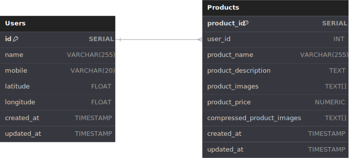

# Zocket SDE Intern Assignment


[Video Demo On YouTube](https://youtu.be/jme_rwKkeQs)

## Major new things I Learned

- Building a Microservice Architecture
- Testing an API which involves a database
- Using Kafka, ORM(tried implementing it didn't work out) and Mocking Databases(partially)


## Flow of Request & Data

1. User makes a POST request to the API.
2. The API validates the request and sends it to Postgres.
3. Postgres writes the data to the database and returns the productID.
4. The API then sends the userID and productID to Kafka as a JSON message.
5. The Image service consumes the message and makes queries to the database to get the image array.
6. The Image service then downloads the images, compresses the image and stores in the local storage.
7. The path to this compressed image is then stored in the database.

## System Requirements

- Go
- Docker Engine

## How to run

1. Clone the repository

```bash
git clone https://github.com/JammUtkarsh/zocket-SDE
cd zocket-SDE
```

2.  Run Tests

```bash
export $(cat .env | xargs)
docker compose up --build -d db kafka 
go test ./... # Will see 1 test failing
docker compose down -v # Cleanup
```

3. Run All Services

```bash
docker compose up --build
```

4. Make HTTP POST request to the API using cURL

```bash
# Make a POST request to the API
# a file named imageList.txt is provided in the repository for adding Images
curl --location --request POST '127.0.0.1:8080/' \
--header 'Content-Type: application/json' \
--data '{
    "user_id": 1,
    "product_name": "Practical Plastic Computer",
    "product_description": "International",
    "product_price": 268.86,
    "product_images": [
        "https://usercontent.one/wp/cupcake.nilssonlee.se/wp-content/uploads/2022/08/JOWI0527-scaled.jpg",
        "https://usercontent.one/wp/cupcake.nilssonlee.se/wp-content/uploads/2022/08/JOWI0519-scaled.jpg"
    ]
}'
```

OR [Postman](https://www.postman.com/jammutkarsh/workspace/jammutkarsh-apis/request/29627550-7888fc91-1d04-41b8-9550-a2f750a5c8c3?ctx=documentation)

## DB Schema



## Foreword

There are a few unresolved issues in the codebase which I would like to address here.

*First*, Using mock database was something new to me, I tried implementing it but couldn't get it like a real database. To resolve this issue, I created another docker compose specifically for testing, but there was again some issue with the docker network. I tried to resolve it but couldn't. So, I finally decided to prioritize finishing the assignment first.

*Second*, Getting the image array after 1st request failed for some reason, I tried to debug it, there was nothing. While everything was getting written onto the database, the image array was not getting fetched the Image service. I also couldn't find any solution to this online.

*Lastly about testing*, I feel in my tests, there is no clear boundary between unit and integration tests. I am specifically pointing toward the API endpoint test, which involves the database and Kafka.

---
